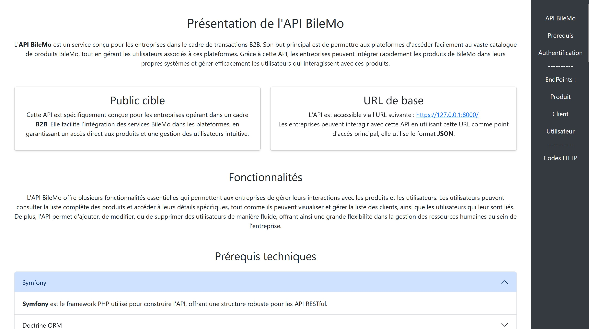

# Documentation API REST BileMo 📘

> **Un site simple pour documenter l'utilisation de l'API REST de BileMo (Projet 7 d'OpenClassrooms).**  
> --> *Version : [English](README.md)* 📖

## 📖 Description  

- Cette documentation en ligne détaille l'utilisation de l'API REST de BileMo, développée dans le cadre de mon Projet 7 sur OpenClassrooms.
- Elle offre une présentation claire des endpoints, des méthodes disponibles et des exemples de requêtes.  
- Ce projet a été réalisé exclusivement dans un contexte pédagogique et n'a aucune vocation professionnelle.  

---

Merci d’avoir pris le temps de découvrir ce projet.  
N’hésitez pas à l’explorer, l’apprendre et l’améliorer ! ✨   
Pour toute question ou collaboration, n’hésitez pas à me contacter ! 📩

[TolMen](https://github.com/TolMen) - [LinkedIn](https://www.linkedin.com/in/jessyfrachisse/)
